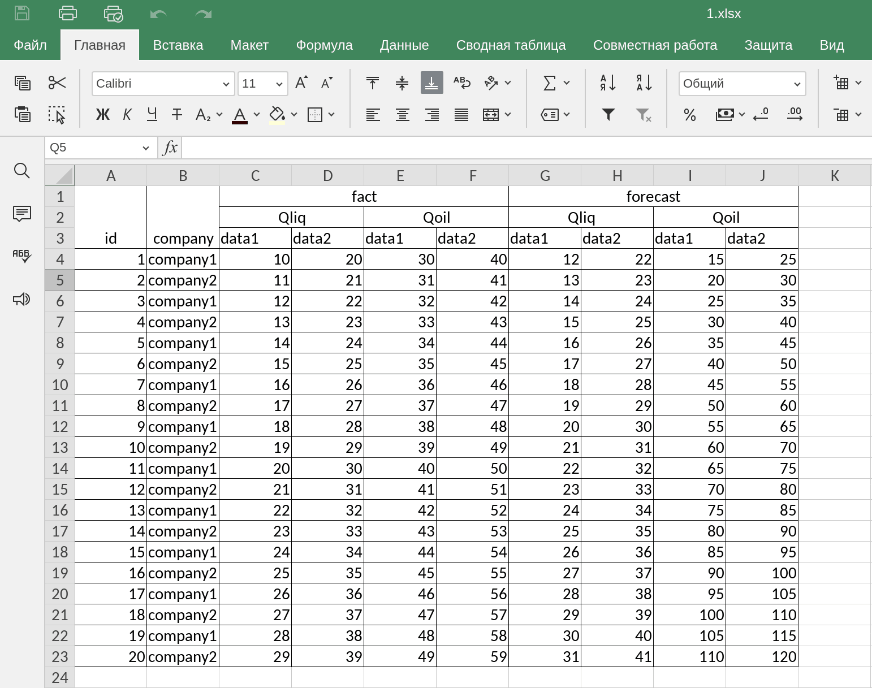

# Web-парсер Excel таблицы с данными 

Предназначен для парсинга данных из Excel-файла заданного формата.

### Особенности реализации:
+ Создаётся нормализованная таблица БД, содержащая идентификатор компании, её наименование, дату, на которую заносится 
информация, значащие данные Qliq и Qoil и идентификатор типа данных - прогнозные или фактические;
+ Данные считываются и заносятся в БД на основании указанных пользователем дат;
+ Добавлены результирующие суммарные значения для полей Qliq и Qoil по датам и типам данных;
+ Реализован функционал просмотра уже занесенных в БД данных который полностью восстанавливает структуру таблиц 
исходного Excel-файла;
+ Применены некоторые фильтры входных данных, помогающие сохранить целостность информации в БД.

Приложение доступно для тестового использования по [ссылке](http://german.anufrikov.com:8080/parser/).

### Комментарии по установке:
**Необходимо выполнить следующие действия:**
+ Склонировать репозиторий;
+ Создать директорию `db` в корне проекта;
+ Создать файл `.env` и указать в нем Django `SECRET_KEY`;
+ В зависимости от окружения, где будет запущено приложение, проверить актуальность значений переменных;
`ALLOWED_HOSTS` и `CSRF_TRUSTED_ORIGINS` в файле настроек приложения `setting.py`;
+ Запустить контейнеры командой `docker-compose up -d --build`;
+ Применить миграции БД командой `docker exec excelparser-web-1 python manage.py migrate`;
+ Собрать статические файлы приложения командой `docker exec excelparser-web-1 python manage.py collectstatic`;
+ Приложение будет доступно по адресу http://YOUR_HOST_NAME:8080/parser.

# Web application for parsing data from Excel document

This application is designed for parsing data from the specified format Excel file.

### Some features:
+ A normalized database table is created, which contains the company's ID, its name, date, Qliq and Qoil data 
and data type identifier (forecast or actual);
+ A normalized database table is created containing the company ID, its name, the date on which
the information is entered, significant Qliq and Qoil data, and the data type identifier - forecast or actual
+ The data is recorded in the database based on the dates specified by the user;
+ Summary values for all the Qliq and Qoil fields added;
+ You can view parsed data via special functionality that completely restores the original structure of the tables
in Excel file;
+ Some input data filters have been applied for the data integrity reasons.

You can test this app [here](http://german.anufrikov.com:8080/parser/).

### Installation instructions:
**Please follow these steps:**
+ Clone this repository;
+ Create `db` directory in the project root;
+ Create `.env` file and provide the `SECRET_KEY` value;
+ Please check `ALLOWED_HOSTS` and `CSRF_TRUSTED_ORIGINS` variables in `setting.py` for relevance;
+ Run docker-containers via `docker-compose up -d --build`
+ Apply database migrations via `docker exec excelparser-web-1 python manage.py migrate`;
+ Collect static files via `docker exec excelparser-web-1 python manage.py collectstatic`;
+ The application will be ready for testing at http://YOUR_HOST_NAME:8080/parser.